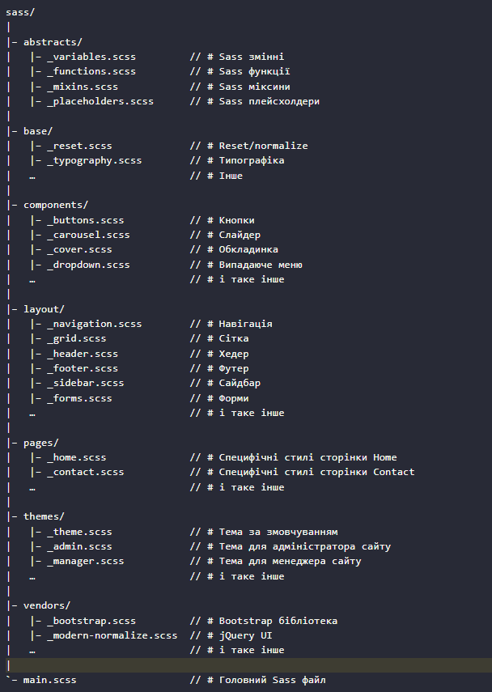

# Структура SASS 7-1

Проект використовує популярну структуру SASS 7-1, яка організує стилі у сім основних папок, і один основний файл (`main.scss`), який імпортує всі стилі.
Нижче наведено опис кожної папки та її призначення:

!!! Після копіювання темплейту потрібно видалити файл _test.scss !!!
!!! Налаштувати та підключити структуру відповідно до вашого проекту !!!

# Automated SVG icon sprites: Vite Edition

Проект має плагін для створення спрайту картинок що будуть зібрані в одному файлі в папці public - icon-sprite.svg 
Посилання на документацію плагіна https://kld.dev/svg-icon-system-vite-edition/

